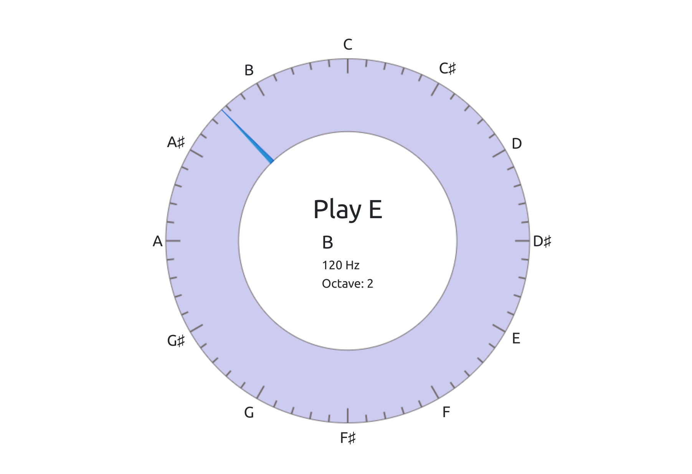

# Pitch Detection App
An open source pitch detection app that uses Rust and WebAssembly

## Live Demo
[](https://alesgenova.github.io/pitch-detection-app/)

## Components
### Core Pitch Detection Library
- Rust ([source](https://github.com/alesgenova/pitch-detection))

### Communication with web worker
- post-me ([source](https://github.com/alesgenova/post-me))

### WebAssembly Wrapper
- Rust / wasm-bindgen ([source](https://github.com/alesgenova/pitch-detection-app/tree/master/wasm))

### Pitch Visualization
- TypeScript, HTML5 Canvas, D3 ([source](https://github.com/alesgenova/pitch-detection-app/tree/master/display))

### Single Page App
- React ([source](https://github.com/alesgenova/pitch-detection-app/tree/master/client))

### Building
```bash
# Build wasm
# Prerequisite: cargo and wasm-pack
cd wasm
wasm-pack build --target web

# Build the visualization
cd ../display
npm install
npm run build

# Start the app
cd ../client
npm install
npm run start

# In the display and client dirs if you run into issues with npm try yarn instead
# and be aware you need node version 16 so nvm may be useful:
nvm use 16
yarn install
yarn run start
```
